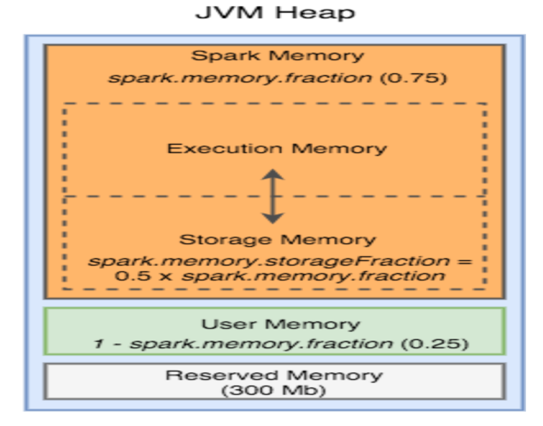

There is no magic solution to provisioning of resources. However these are the general guidelines that can help you to improve the performance of your spark jobs. But do test them out in development environment before psuhing it to prod.

Calculate and set the following Spark configuration parameters carefully for the Spark application to run successfully:

spark.executor.memory – Size of memory to use for each executor that runs the task.
spark.executor.cores – Number of virtual cores.
spark.driver.memory – Size of memory to use for the driver.
spark.driver.cores – Number of virtual cores to use for the driver.

The number of executor cores will decide the number of parralel task . Each task will execute per partition basis. Based on historical data, it is recommended to have five virtual cores for each executor to achieve optimal results in any sized cluster.

In order to estimate the number of partitions you can use the below guide for your reference. 

```               
                                     //Source
                                       S3
                                       |
                   +-------------------v--------------------------------+
                   |        File: Splittable or Unsplittable?           |
                   +-------------------+------------------------+-------+
               splittable              |                        |
                 +---------------------+                        |
    +------------v------+                                       |Unsplittable
    |  Each file size   |                                       |
    +-------+--------+--+    file-size > 64MB                   v
            |        +------------------------+   Input Partition = The num of files
            |                                 |
            |file-size < 64MB                 |
            |                                 v
            |                     Input Partition = (ALL file-size)/64MB
            v
 Input Partition = The num of files
```

 MaxNeededExecutors = (InputPartition)/(TheNumOfTasks per Executor) = 428/5 = 86


Number of executors per instance = (total number of virtual cores per instance - 1)/ spark.executors.cores

Here we have subtracted one virtual core from the total number of virtual cores to reserve it for the Hadoop daemons.



Let us analyse the JVM heap of Spark Executor. We need to reserve 1 Gb memory and 1 core for YARN and Hadoop daemons. 
Executor overhead max memory is calculated as 
      max(284,0.1 * Executor memory )

Now coming to JVM heap 
- 300 Mb memory is reserved.
- spark.memory.fraction - It is the fraction of heap space which is used for execution and storage. By default its value is set to 0.75 rest is the user memory.
- User Memory - It's mainly used to store the data needed for RDD conversion operations, such as the information for RDD dependency.

Now each executor is suited to run 5 parallel tasks. Execution memory required for 5 task would be around 64*5 ~= 350 MB.
Spark memory = 700 MB 
User memory = 240Mb 
Total Spark Memory = 1240 Mb 
Total Exector Memory = 1240 + 284 = 1524 MB

For m4.xlarge instance yarn allocates 12288 memory. 

Also many blogs and even satckoverflow mentions that you need 1:1 mapping between the number of executor cores and instance vcpu. But in my experience it is not the case. Even in the 2015 Spark Databricks conferenece Sammer Farooqui mentioned thiss too be a common misconception amongst the spark community and insisted on oversubscribing of resources. 

m4.xlarge instancce has 4 VPC and 16 Gb RAM. Now we will set aside 1 VCPU and 1 GB of RAM for the Haadoop daemons.
Yarn allocates a container of size 12288 MB.
You can easily run 2 exceutor with 5.5 GB RAM  and 5 executor coress each. These executor cores are running inside the JVM and it is  upto the OS scheduler and JVM to communicate for CPU resources.

   